# Reference Architecture: GenAI-Assisted Modernization Framework

## 1. Layered Framework

The framework is organized into five sequential layers. Each layer consumes the
previous layer's output, forming an end-to-end pipeline from raw legacy input to
governed, documented, Snowflake-ready output.

```mermaid
flowchart LR
    subgraph Input["1. Input Layer"]
        A1[Legacy ETL Jobs]
        A2[SQL Scripts]
        A3[Metadata / Mapping Docs]
        A4[Workflow Definitions]
    end

    subgraph AI["2. AI Analysis Layer"]
        B1[Code Understanding]
        B2[Dependency Discovery]
        B3[Business Rule Extraction]
        B4[Migration Recommendation]
    end

    subgraph Transform["3. Transformation Layer"]
        C1[ELT Conversion]
        C2[SQL Optimization]
        C3[dbt Model Generation]
        C4[Snowflake Object Mapping]
    end

    subgraph HITL["Human-in-the-Loop Checkpoint"]
        H1[Developer Review & Sign-off]
    end

    subgraph Validate["4. Validation Layer"]
        D1[Business Rule Verification]
        D2[Metadata Validation]
        D3[Quality Checks]
        D4[Documentation Review]
    end

    subgraph Output["5. Output Layer"]
        E1[Modernized Snowflake/dbt Design]
        E2[Migration Documentation]
        E3[AI Recommendations]
        E4[Governance Reports]
    end

    Input --> AI --> Transform --> HITL --> Validate --> Output
```

## 2. Why a Human-in-the-Loop Checkpoint

Market-standard AI-assisted migration tooling (see `competitive-landscape.md`)
never treats LLM output as final. A mandatory review gate between the
Transformation and Validation layers is what separates a credible enterprise
framework from a naive "AI auto-converts everything" pitch. In the PoC, this
checkpoint is simulated as an explicit approval step in the orchestration script
before validation runs.

## 3. Snowflake Target Architecture

| Layer | Purpose |
|---|---|
| **Landing Layer** | Raw ingestion, schema-on-read, minimal transformation |
| **Staging Layer** | Type casting, deduplication, standardization (dbt `staging` models) |
| **Curated Layer** | Business-rule-applied, conformed entities (dbt `intermediate` models) |
| **Data Mart Layer** | Consumption-ready facts/dimensions (dbt `marts` models) |
| **Metadata Repository** | Lineage, extracted business rules, AI analysis artifacts |
| **Monitoring Components** | dbt tests, freshness checks, validation reports |
| **Security Layer** | RBAC, masking policies, governance tagging |

## 4. Modernization Workflow

1. Discovery
2. Assessment
3. AI Analysis
4. Migration Planning
5. Code Transformation
6. **Human Review (added checkpoint)**
7. Validation
8. Documentation
9. Deployment

## 5. Cost & Latency Considerations

LLM usage is not free, and a real framework has to account for this explicitly:

- **Model tiering**: Use a smaller/cheaper model for high-volume, low-risk tasks
  (e.g., summarizing a workflow, generating docstrings) and reserve a frontier
  model for high-stakes tasks (e.g., business rule extraction where errors
  propagate downstream).
- **Batching**: Legacy codebases often contain hundreds of similar scripts —
  batch requests and cache results for repeated patterns rather than
  re-analyzing near-identical jobs.
- **Latency budget**: Interactive developer-facing steps (code explanation)
  should target sub-10s responses; batch documentation generation can run
  asynchronously overnight.

## 6. Hallucination Guardrails

The AI Analysis and Transformation layers are treated as **untrusted by
default**. Every LLM output passes through the rule-based Validation Layer
(see `prototype/src/validate.py`) before being marked "ready for review."
Guardrails implemented in the PoC:

- Structured JSON-schema outputs (not free text) so downstream code can
  mechanically check completeness.
- Cross-referencing extracted column/table names against the actual source
  script (catches invented entities).
- A confidence/coverage score reported alongside every AI-generated artifact,
  not just the artifact itself.
