# Reference Architecture: GenAI-Assisted Modernization Framework

## 1. Layered Framework

The framework runs as six sequential phases behind a single orchestrator
(`prototype/main.py`). Each phase consumes the previous phase's output and
writes its own artifact to `prototype/output/`, forming an end-to-end pipeline
from raw legacy input to a governed, documented, Snowflake-ready design.

```mermaid
flowchart LR
    subgraph Input["Input"]
        A1[Legacy SQL scripts]
        A2[Declared metadata]
        A3[Workflow manifest]
        A4[Ground-truth rules]
    end

    subgraph Pipeline["Orchestrated pipeline — prototype/main.py"]
        direction LR
        B1["1. AI Analysis<br/>ai_analysis.py"]
        B2["2. Metadata Interpretation<br/>metadata_interpreter.py"]
        B3["3. Transformation<br/>transform.py"]
        H1["4. Human Review Gate<br/>main.py checkpoint"]
        B4["5. Validation<br/>validate.py"]
        B5["6. Plan & Output<br/>planner · lineage · estimator · docs"]
        B1 --> B2 --> B3 --> H1 --> B4 --> B5
    end

    subgraph Output["Output"]
        E1[dbt models for Snowflake]
        E2[Migration report & plan]
        E3[Lineage & effort estimates]
        E4[Validation / governance report]
    end

    Input --> Pipeline --> Output
```

Only phase 1 depends on the LLM. Phases 2-6 are deterministic Python, so a
model error is caught by code and by a reviewer rather than propagating into
the delivered design. The provider itself is swappable — `src/llm_client.py`
selects Anthropic, OpenAI or a deterministic `mock-heuristic` fallback based on
which API key is present, and the pipeline runs end to end with no key at all.

## 2. Why a Human-in-the-Loop Checkpoint

Market-standard AI-assisted migration tooling (see `competitive-landscape.md`)
never treats LLM output as final. A mandatory review gate between the
Transformation and Validation layers is what separates a credible enterprise
framework from a naive "AI auto-converts everything" pitch. In the PoC the gate
is a real interactive prompt in `main.py`: each ambiguity-flagged rule must be
approved, edited or rejected before validation runs, an edit updates the rule
that validation then scores, and a rejection exits non-zero. `--auto-approve`
bypasses the prompt for CI only.

## 3. Snowflake Target Architecture

| Layer | Purpose |
|---|---|
| **Landing Layer** | Raw ingestion, schema-on-read, minimal transformation |
| **Staging Layer** | Type casting, deduplication, standardization (dbt `staging` models) |
| **Curated Layer** | Business-rule-applied, conformed entities (dbt `intermediate` models) |
| **Data Mart Layer** | Consumption-ready facts/dimensions (dbt `marts` models) |
| **Metadata Repository** | Lineage, extracted business rules, AI analysis artifacts |
| **Monitoring Components** | dbt tests, freshness checks, validation reports |
| **Security Layer** | RBAC, masking policies, governance tagging |

## 4. Phase-by-Phase Detail

The order below is the order `prototype/main.py` executes.

| # | Phase | Module | What it does | Artifact |
|---|---|---|---|---|
| 1 | AI Analysis | `src/ai_analysis.py` | Reads the legacy SQL — a single script, or every job in a workflow manifest — and extracts tables, business rules and dependencies as structured JSON, flagging any rule it cannot justify from the source | `analysis.json` (+ one file per workflow job) |
| 2 | Metadata Interpretation | `src/metadata_interpreter.py` | Cross-references the declared metadata against the SQL that actually runs: columns documented but never used, columns used but never documented, comments that contradict the code | `metadata_interpretation.json` |
| 3 | Transformation | `src/transform.py` | Rebuilds the logic as a Snowflake-ready dbt project — staging → intermediate → marts — with sources and tests declared | `dbt_models/`, `sources.yml`, `schema.yml` |
| 4 | **Human Review Gate** | `main.py` → `human_checkpoint()` | Every ambiguity-flagged rule must be approved, edited or rejected; reject halts the run. `--auto-approve` keeps CI non-interactive | reviewer-approved rule set, or a halted pipeline |
| 5 | Validation | `src/validate.py` | Scores AI output against hand-annotated ground truth on entity grounding, business rule coverage and ambiguity recall; returns `PASS` or `REVIEW_REQUIRED` | `validation_report.json` |
| 6 | Plan & Output | `migration_planner.py`, `lineage.py`, `estimator.py`, `generate_docs.py` | Sequences the migration by dependency with effort and blocking flags, draws the lineage graph, estimates effort and cost, writes the migration report | `migration_plan.json`, `lineage.json/.dot/_mermaid.md`, `estimates.json`, `migration_report.md` |

Deployment to a customer Snowflake account sits outside the PoC — the framework
stops at a reviewed, validated design plus the plan to deploy it.

## 5. Cost & Latency Considerations

LLM usage is not free, and a real framework has to account for this explicitly:

- **Model tiering**: Use a smaller/cheaper model for high-volume, low-risk tasks
  (e.g., summarizing a workflow, generating docstrings) and reserve a frontier
  model for high-stakes tasks (e.g., business rule extraction where errors
  propagate downstream).
- **Batching**: Legacy codebases often contain hundreds of similar scripts —
  batch requests and cache results for repeated patterns rather than
  re-analyzing near-identical jobs.
- **Latency budget**: Interactive developer-facing steps (code explanation)
  should target sub-10s responses; batch documentation generation can run
  asynchronously overnight.

## 6. Hallucination Guardrails

The AI Analysis and Transformation layers are treated as **untrusted by
default**. Every LLM output passes through the rule-based Validation Layer
(see `prototype/src/validate.py`) before being marked "ready for review."
Guardrails implemented in the PoC:

- Structured JSON-schema outputs (not free text) so downstream code can
  mechanically check completeness.
- Cross-referencing extracted column/table names against the actual source
  script (catches invented entities).
- A confidence/coverage score reported alongside every AI-generated artifact,
  not just the artifact itself.
