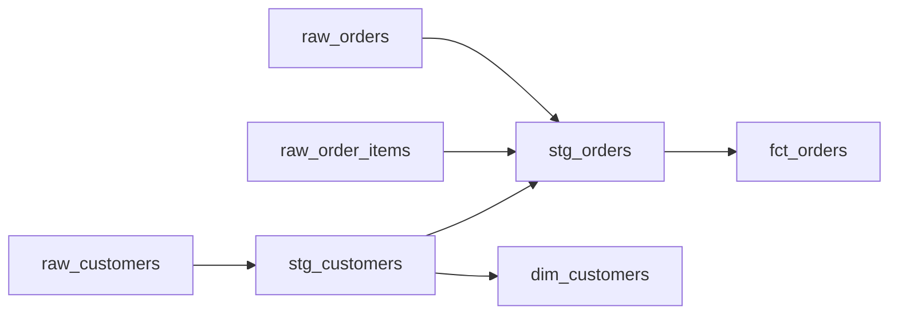

# Migration Report: legacy_customer_orders_etl.sql

_Generated: 2026-09-25 10:50 UTC_
_AI Provider: mock / Model: mock-heuristic-v1_

> ⚠️ **This report is AI-generated and has NOT yet passed human review.** Per the framework's human-in-the-loop checkpoint (see docs/architecture.md), a developer must review flagged items below before this migration is considered approved.

## 1. Overview

- **Tables involved:** dim_customers, fct_orders, raw_customers, raw_order_items, raw_orders, stg_customers, stg_orders
- **Business rules identified:** 8
- **Rules flagged for human review (ambiguous):** 2
- **Validation status:** PASS

## 2. Business Rule → Snowflake/dbt Mapping

| ID | Rule | Description | Confidence | Needs Review |
|---|---|---|---|---|
| AI-01 | Customer Region Mapping | region_code mapped to a full region name via CASE statement. | 0.95 | No |
| AI-02 | Customer Tier Classification | Customer tier derived from lifetime_value thresholds. | 0.95 | No |
| AI-03 | Tier-Based Discount | Discount percentage applied based on customer_tier (PLATINUM/GOLD/SILVER/else). | 0.9 | No |
| AI-04 | Order Aging Discount Exception | Additional discount applied when order age exceeds 90 days. | 0.6 | ⚠️ YES |
| AI-05 | Order Status Normalization | Raw status codes normalized into CANCELLED/FULFILLED/IN_PROGRESS/UNKNOWN buckets. | 0.9 | No |
| AI-06 | Active Customer Filter | Only customers with active_flag = 'Y' are included. | 0.95 | No |
| AI-07 | 2-Year Order Window | Only orders within the last 24 months are processed. | 0.55 | ⚠️ YES |
| AI-08 | Customer Dimension SCD Type 1 | dim_customers refreshed via MERGE with overwrite semantics; no history retained. | 0.85 | No |

### Ambiguous Rules Requiring Human Sign-off

- **AI-04 — Order Aging Discount Exception**: Business justification for the 90-day / 2% values is not present in the source script; flagged for human review rather than assumed.
- **AI-07 — 2-Year Order Window**: No documented business reason found for the 24-month cutoff; flagged for human review.

## 3. Data Lineage / Dependencies

### Lineage artifacts

- JSON adjacency: `output\lineage.json`
- Graphviz DOT: `output\lineage.dot`
- Mermaid snippet: `output\lineage_mermaid.md`

## 4. Generated dbt/Snowflake Artifacts

- `output\dbt_models\sources.yml`
- `output\dbt_models\staging\stg_customers.sql`
- `output\dbt_models\staging\stg_orders.sql`
- `output\dbt_models\intermediate\int_order_line_discounts.sql`
- `output\dbt_models\marts\fct_orders.sql`
- `output\dbt_models\marts\dim_customers.sql`
- `output\dbt_models\schema.yml`

## 5. Validation Summary

**Overall status:** PASS

**Checks passed:**
- ✅ Entity Grounding Accuracy: 100.0%
- ✅ Business Rule Extraction Coverage: 100.0%
- ✅ Ambiguity Flag Recall: 100.0%

**Checks requiring attention:**
- None

## Metadata Interpretation Findings

### Undocumented columns referenced in SQL
- stg_customers.customer_tier: referenced in SQL but not present in metadata
- stg_customers.rowid: referenced in SQL but not present in metadata
- d.customer_name: referenced in SQL but not present in metadata
- d.region: referenced in SQL but not present in metadata
- d.customer_tier: referenced in SQL but not present in metadata
- d.customer_id: referenced in SQL but not present in metadata
- s.customer_name: referenced in SQL but not present in metadata
- s.customer_tier: referenced in SQL but not present in metadata
- s.customer_id: referenced in SQL but not present in metadata
- s.region: referenced in SQL but not present in metadata
- s.created_date: referenced in SQL but not present in metadata
- s.email: referenced in SQL but not present in metadata
- 0.15: referenced in SQL but not present in metadata
- 0.02: referenced in SQL but not present in metadata
- 0.10: referenced in SQL but not present in metadata
- 0.05: referenced in SQL but not present in metadata
- i.e: referenced in SQL but not present in metadata
- raw_customers.customer_name: referenced in SQL but not present in metadata
- raw_customers.customer_tier: referenced in SQL but not present in metadata
- raw_customers.region: referenced in SQL but not present in metadata
- raw_customers.customer_id: referenced in SQL but not present in metadata
- raw_customers.created_date: referenced in SQL but not present in metadata
- raw_customers.email: referenced in SQL but not present in metadata
- raw_customers.hardcoded: referenced in SQL but not present in metadata
- order_date.days: referenced in SQL but not present in metadata
- stg_orders.order_date: referenced in SQL but not present in metadata

### Declared metadata columns not used by the SQL (potential dead columns)
- stg_customers.customer_name
- stg_customers.email
- stg_customers.region_code
- stg_customers.lifetime_value
- stg_customers.created_date
- fct_orders.order_id
- fct_orders.customer_id
- fct_orders.product_id
- fct_orders.order_date
- fct_orders.quantity
- fct_orders.unit_price
- fct_orders.net_line_amount
- fct_orders.derived_status
- dim_customers.customer_id
- dim_customers.customer_name
- dim_customers.email
- dim_customers.region
- dim_customers.customer_tier
- dim_customers.created_date
- dim_customers.legacy_flag

### Inconsistent or suspicious column comments
- stg_customers.customer_id: comment suggests legacy/deprecated but column is actively used/normalized in SQL -- comment: Primary key - legacy customer identifier
- raw_orders.order_status: comment suggests legacy/deprecated but column is actively used/normalized in SQL -- comment: Status code (legacy mixed vocabulary)
- raw_order_items.unit_price: comment suggests legacy/deprecated but column is actively used/normalized in SQL -- comment: Unit price in cents - legacy rounding differs from modern systems
- stg_orders.quantity: comment suggests legacy/deprecated but column is actively used/normalized in SQL -- comment: Quantity - note: legacy system allowed negative adjustments

## Migration Plan

| Order | Table | Effort | Blocking | Rules touching |
|---|---|---|---|---|
| 1 | raw_customers | Low | False | - |
| 2 | raw_order_items | Low | False | - |
| 3 | raw_orders | Low | False | - |
| 4 | stg_customers | Low | False | - |
| 5 | dim_customers | Medium | False | AI-08 |
| 6 | stg_orders | Low | False | - |
| 7 | fct_orders | Low | False | - |

## 7. Estimated Cost, Time & Efficiency

**Summary:**
- Total estimated hours: 15.25h
- Total estimated cost: $1220.0
- Estimated efficiency vs manual baseline: 41.9%

**Per-layer details:**

- Discovery Assessment: 2.7h ($216.0)
- Ai Analysis: 5.75h ($460.0)
- Transformation: 1.75h ($140.0)
- Validation: 1.3h ($104.0)
- Documentation Planning: 3.75h ($300.0)

## 6. Recommendation

All automated checks passed. Recommend proceeding to human review of flagged ambiguous rules, then promotion to the Snowflake target environment.
